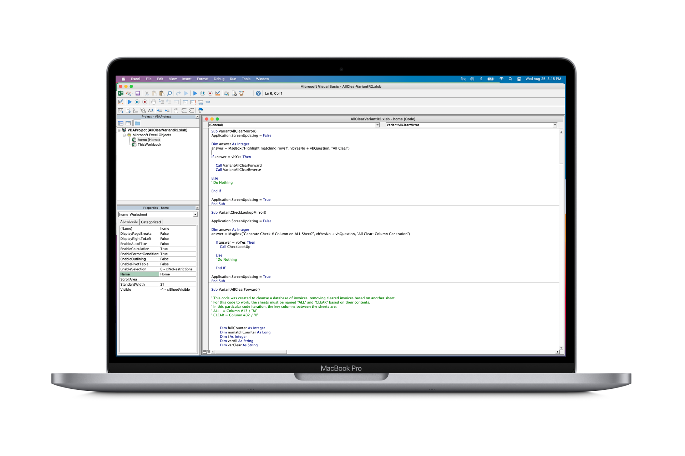

# All Clear
Microsoft Excel (VBA Macro)

### Background

Current invoice clearing procedures across the company, was a time-intensive, manual procedure. The process, which required at least 50+ man hours per month (across a team of 3-5 people) on matching and clearing invoices, was suggested to be automated by any means possible.

I developed a macro for the VP of Operations of our ad agency to help him clear invoices and automate a portion of the workflow. It was only 235 lines of VBA code, but it was so effective he set out to change their entire invoicing operations to conform to the macro. It saves about 50+ hours in invoicing operations per month, an equivalent to over 600 hours per year saved every year for the agency.

When I was given this task, I actually had zero experience in programming, and have never actually written code in my life (aside from Excel formulas and logic, which I was already proficient at). In the span of two weeks, I learned the foundations of VBA programming and completed the macro after 4 iterations (after getting feedback from the VP and his team). The macro is still in use today.
